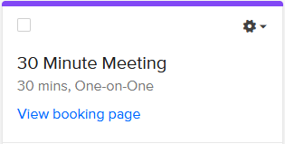

### Hello there, I'm Bryan &#12299;Software Engineer

 

> Ahoy-hoy! Bryan Bailey here - 👨🏾‍💻 developer, 👨🏽‍👩🏽‍👧🏽‍👦🏽 father, 🎹 musician. 
>
>- 🔭 I’m currently working on ... **Yo!nk** - A Comic Scraper
>- 🌱 I’m currently learning ... `nodejs`, `react`
>- 👯 I’m looking to collaborate on ... `game dev`, `music`, `open source`, `automation`, etc
>- 🤔 I’m looking for help with ... `game dev`
>- 💬 Ask me about ... `python`, `c#`, `docker`, `bash`, `aws`, `music`, `game dev`
>- 📫 How to reach me: ... Make an [Appointment](https://calendly.com/brizzledev/30min)
>- 😄 Pronouns: ... he/him/his
>- ⚡ Fun fact: ... I named my son after Batman 🦇

## Lanuages, Frameworks &amp; Tools -- Oh, My

## Learning Queue

 

    
<strong>🔒 &nbsp;&nbsp;PGP Public Key</strong>

    <pre>
-----BEGIN PGP PUBLIC KEY BLOCK-----
Version: FlowCrypt Email Encryption 8.2.8
Comment: Seamlessly send and receive encrypted email

xjMEYnRCLBYJKwYBBAHaRw8BAQdA7LQM/Pi1kcZ8K3Le6uNZrpe6cq+8Wi9r
BHIeC24sSPLNI0JyeWFuIEJhaWxleSA8YnJpenpsZWRldkBnbWFpbC5jb20+
wo8EEBYKACAFAmJ0QiwGCwkHCAMCBBUICgIEFgIBAAIZAQIbAwIeAQAhCRCw
xm+iJitszhYhBEyIj+egJqioitaTNbDGb6ImK2zOG3sA/i+R9P5nXDWL6MjX
0IKnQHQP23KW22yu6U01YlekISh5AP95Lpo9j56skKmUShh6+ldO5i3m5Chc
cmyUGRnwytFcBs44BGJ0QiwSCisGAQQBl1UBBQEBB0D6S1BoKtMemaL6ORq5
V7cNKkDDmLQEg/FuQHMCo278LwMBCAfCeAQYFggACQUCYnRCLAIbDAAhCRCw
xm+iJitszhYhBEyIj+egJqioitaTNbDGb6ImK2zOog8BALMqOWMMborBXocU
Ay8S2MEnNYerOREKUTrLXsZJ4dmDAQD+gOlUQR26UBLF17sQ91WTxKcOGhPS
NYLUh/LDVqcXDg==
=6puW
-----END PGP PUBLIC KEY BLOCK-----
    </pre>

